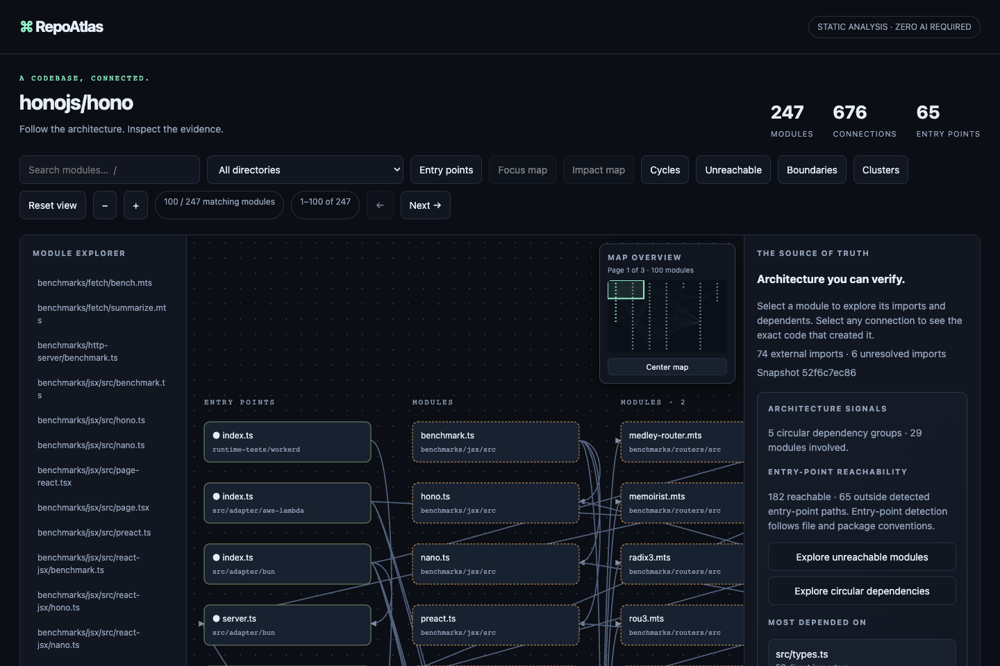
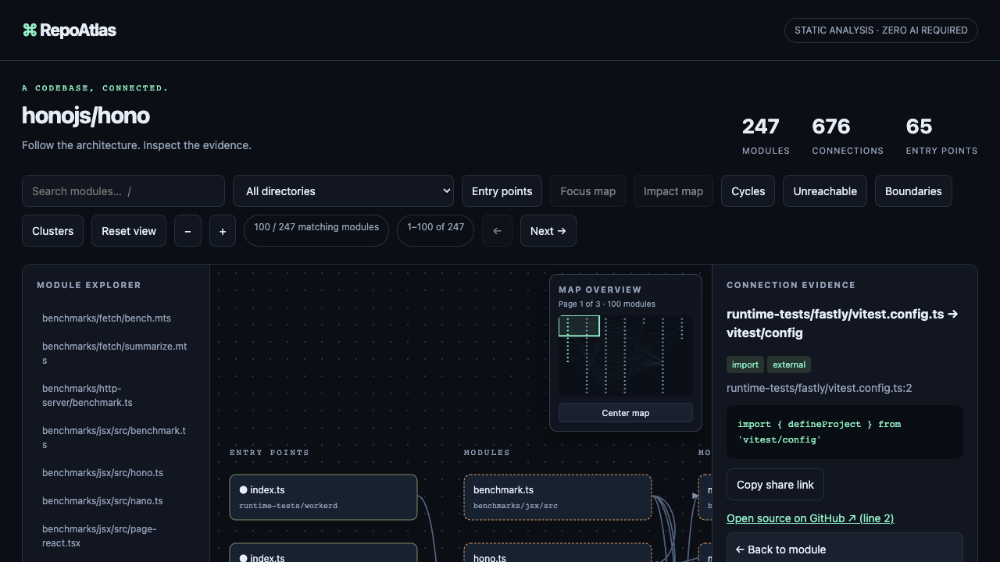

<h1 align="center">
  
</h1>

<h2 align="center">Map a TypeScript codebase.<br>Trace every connection to source.</h2>

<p align="center">Understand an unfamiliar project through its entry points, modules, and imports. Select any connection to inspect the original code and line.</p>

<p align="center">
  <a href="https://github.com/maximilianfeix/repoatlas/stargazers"></a>
  <a href="https://github.com/maximilianfeix/repoatlas/actions/workflows/ci.yml"></a>
  <a href="https://github.com/maximilianfeix/repoatlas/actions/workflows/codeql.yml"></a>
  <a href="https://github.com/maximilianfeix/repoatlas/blob/main/LICENSE"></a>
  
</p>

<p align="center">
  <a href="https://maximilianfeix.github.io/repoatlas/examples/zustand.html"><strong>Open the interactive demo</strong></a> ·
  <a href="https://maximilianfeix.github.io/repoatlas/#make-a-map">Build a command</a> ·
  <a href="#quickstart">Quickstart</a> ·
  <a href="#github-actions">GitHub Action</a> ·
  <a href="https://github.com/maximilianfeix/repoatlas/issues">Issues</a>
</p>

<p align="center">
  <a href="https://maximilianfeix.github.io/repoatlas/examples/hono.html"></a>
</p>

RepoAtlas creates a **standalone, interactive architecture map** from a TypeScript project. Unlike a diagram inferred from prose, each internal connection comes from a parsed import and can be checked against its exact source line. The exported HTML works offline and can be shared as one file.

## See architecture boundaries

The boundary view compares workspace packages and source directories. Each count opens the exact imports behind it.

<p align="center">
  <a href="https://maximilianfeix.github.io/repoatlas/examples/hono.html"></a>
</p>

## Navigate larger codebases

The Hono demo has 247 modules. RepoAtlas pages large results, groups the visible modules by their workspace or directory, and adds a clickable overview so wide maps stay navigable. The highlighted viewport moves with the graph; the module explorer remains available for keyboard navigation.

<p align="center">
  <a href="https://maximilianfeix.github.io/repoatlas/examples/hono.html"></a>
</p>

## Trace how a module is reached

Select any reachable module to see its shortest resolved-import path from a detected entry point. The path stays explicitly static and heuristic-backed; each highlighted edge opens its exact import line and source link.

<p align="center">
  <a href="https://maximilianfeix.github.io/repoatlas/examples/hono.html"></a>
</p>

## Quickstart

Requires **Node.js 22+** and **Git**. Map a public GitHub repository:

```sh
npx --yes --package=github:maximilianfeix/repoatlas -- repoatlas https://github.com/pmndrs/zustand -o zustand-map.html
```

Open `zustand-map.html` in your browser. No clone, account, API key, or global install is needed. For a local checkout, replace the repository URL with its directory:

RepoAtlas currently installs from GitHub; it is not published to the npm registry.

```sh
npx --yes --package=github:maximilianfeix/repoatlas -- repoatlas ./my-project -o architecture.html
```

## GitHub Actions

Generate a map for every push and download it from the workflow run's **Artifacts** section. Add `.github/workflows/architecture.yml`:

```yaml
name: Architecture map
on: [push]
permissions:
  contents: read
jobs:
  map:
    runs-on: ubuntu-latest
    steps:
      - uses: actions/checkout@3d3c42e5aac5ba805825da76410c181273ba90b1 # v7.0.1
      - uses: maximilianfeix/repoatlas@v1.8.0
        with:
          output: repoatlas-map.html
```

The action also accepts `path`, `artifact-name`, `retention-days`, `include-tests`, and `include-js`. It needs no token or write permission. Maps embed project paths and source snippets; treat artifacts for private repositories as source code and limit access accordingly.

## Explore real projects

These maps are pinned to the analyzed source commit and need no install:

| Repository | Modules | Connections | Explore |
| --- | ---: | ---: | --- |
| [Zustand](https://github.com/pmndrs/zustand) | 18 | 24 | [Open map](https://maximilianfeix.github.io/repoatlas/examples/zustand.html) |
| [Ky](https://github.com/sindresorhus/ky) | 51 | 93 | [Open map](https://maximilianfeix.github.io/repoatlas/examples/ky.html) |
| [Hono](https://github.com/honojs/hono) | 247 | 676 | [Open map](https://maximilianfeix.github.io/repoatlas/examples/hono.html) |

The analyzed commits, warnings, and upstream license notices are listed in [`docs/examples/manifest.json`](docs/examples/manifest.json) and [`THIRD_PARTY_NOTICES.md`](THIRD_PARTY_NOTICES.md).

The Zustand demo includes a workspace boundary: `examples/starter/src/index.tsx` imports the library's `src/index.ts`. Open that edge to inspect its exact import line and source link.

## What you can inspect

- **Project shape:** source modules, directories, and likely entry points.
- **Dependencies:** static imports, re-exports, type imports, and literal dynamic imports or `require` calls. Computed calls remain visible as unresolved source evidence; their targets are never guessed.
- **Precise CommonJS evidence:** only calls to the global `require` are treated as imports; locally shadowed parameters and variables are ignored.
- **External packages:** browse npm package usage, Node built-ins, and URL imports separately, with import-site counts and clickable source evidence for every usage.
- **Mixed repositories:** opt into `.js`, `.jsx`, `.mjs`, and `.cjs` modules with `--include-js`; TypeScript-only stays the default.
- **Evidence:** the exact import statement and line, with a commit-pinned GitHub link when the checkout is clean.
- **Share discoveries:** copy a direct link to a module, external package, or exact import edge inside the same portable HTML map.
- **Explore maps and assess change:** search, directory and entry-point filters, accessible pagination, Focus map for direct neighbors, and Impact map for every transitively dependent module.
- **Check entry-point reachability:** find modules outside paths from detected entries; if RepoAtlas finds no entry point, reachability stays unknown instead of flagging every file.
- **Trace entry paths:** follow the shortest resolved-import route from a detected entry point to a reachable module, then click each highlighted edge for its exact source evidence.
- **Map monorepo boundaries:** resolve declared npm/Yarn or pnpm workspace exports, compare imports between packages and source directories, and open each populated boundary cell to inspect exact import sites.
- **Spot architecture risks:** isolate circular import groups, trace the exact cycle edges, and jump straight to the most depended-on modules.
- **Compare snapshots:** report added or removed modules and dependency relationships, plus changed import specifiers, between two JSON maps; line shifts alone do not count as architecture drift.
- **Enforce architecture in CI:** fail a workflow on forbidden workspace/directory imports, excess circular groups, or modules outside detected entry paths; emit line-aware GitHub Actions annotations or JSON.
- **Integrate with stable formats:** inspect the versioned snapshot/config JSON Schemas from the CLI; v1 preserves required graph fields and advertises additive computed-import and external-dependency metadata.
- **Navigate large maps:** page through 100 modules at a time, group modules by workspace or top-level directory, and use the overview to jump across wide graph pages.
- **Portable output:** one offline HTML file, full graph JSON, a boundary SVG, or a concise CI text report.

[](https://maximilianfeix.github.io/repoatlas/examples/hono.html)

```sh
repoatlas https://github.com/honojs/hono --ref main -o hono-map.html
repoatlas . --include-tests -o project-map.html
repoatlas . --include-js -o mixed-codebase.html
repoatlas . --json > graph.json
repoatlas compare before.json after.json
repoatlas compare before.json after.json --json > drift.json
repoatlas report after.json --format svg --output boundaries.svg
repoatlas report after.json --format text
repoatlas check after.json --config repoatlas.config.json --format github
repoatlas schema snapshot > repoatlas-snapshot.schema.json
repoatlas --help
```

In JSON output, each module retains its containing `group`; modules in a declared workspace also include the repository-relative `workspace` package path.

## Compare two snapshots

Save a baseline and a current graph, then compare their architecture:

```sh
repoatlas ./my-project --json > before.json
# Update or check out the other revision.
repoatlas ./my-project --json > after.json
repoatlas compare before.json after.json
```

Use `--json` on the compare command to save the full machine-readable delta. Line and formatting changes alone do not create drift; changed import specifiers, module additions/removals, and dependency changes are reported.

### Keep architecture rules in CI

Save a RepoAtlas JSON snapshot and configure checks against its stable package or top-level directory boundaries:

```json
{
  "forbiddenImports": [
    { "from": "package:apps/web", "to": "package:packages/database" }
  ],
  "limits": {
    "cycleGroups": 0,
    "unreachableModules": 12
  }
}
```

Run `repoatlas check atlas.json --config repoatlas.config.json`. Boundary IDs use `package:<workspace path>` for declared workspace packages and `directory:<top-level source folder>` for other files (for example `directory:src`). Each forbidden resolved import is reported with its exact source file, line, and code. `--format github` emits native annotations; use `--format json` for machine-readable results. If no entry point is detected, reachability is unknown and does not trigger the unreachable-module limit; this avoids treating missing heuristic evidence as proof of dead code.

In GitHub Actions, generate and check the snapshot in one step so a violation fails the job:

```yaml
- uses: actions/checkout@v4
- uses: actions/setup-node@v4
  with:
    node-version: 22
- run: |
    npx --yes --package=github:maximilianfeix/repoatlas -- repoatlas . --json > atlas.json
    npx --yes --package=github:maximilianfeix/repoatlas -- repoatlas check atlas.json --config repoatlas.config.json --format github
```

RepoAtlas v1 snapshots use `schemaVersion: 1`. Generate the full JSON Schema at any time with `repoatlas schema snapshot`; use `repoatlas schema config` for the rules file format. Compatibility and migration policy is described in [`SCHEMA.md`](SCHEMA.md).

## Scope and privacy

RepoAtlas performs **static file-dependency analysis**. Entry-point reachability follows resolved imports from entries detected by package metadata and file conventions; entry detection is heuristic, so unreachable means “not found along these static paths,” not proof of dead code. If no entry is detected, reachability is unknown. The boundary matrix groups declared workspace packages separately and other files by their top-level directory; it counts resolved internal imports only. Matrices and SVG exports show at most 80 groups; use the existing search or directory filters to narrow larger projects, or use the text report. Impact map follows resolved internal imports backwards to show potential dependents; circular dependency groups use strongly connected components over the same resolved graph. Workspace links are followed only for packages declared by npm/Yarn workspaces or `pnpm-workspace.yaml` (common `*`, `**`, and exclusion patterns are supported), and export maps remain authoritative for package subpaths. These are source-level signals, not runtime or test-coverage guarantees. RepoAtlas does not execute project code, install target dependencies, or infer runtime calls or framework routes. Computed import calls are shown as unresolved evidence without inferring their targets. Unresolved and external dependencies remain visible as unresolved or external.

Generated directories, declaration files, hidden files, and tests are excluded by default. Use `--include-tests` to include tests and fixtures, and `--include-js` to include JavaScript modules. Analysis is limited to 5,000 source files and 2 MB per source file; the interactive map displays 100 matching modules per page, with previous/next navigation. Cluster mode groups visible modules by declared workspace package or top-level source folder, and a navigable overview appears on pages with more than 50 modules. JSON retains the full analyzed graph. Local edits disable GitHub source links, but source evidence remains embedded in the HTML.

Repository credentials are not copied into the map. Files are read from the selected directory; symlinks are skipped, reads stay within that directory, and the viewer makes no network requests. Since the map contains source snippets, share private-repository maps only with people who already have access to that code.

<details>
<summary>Implementation and compatibility notes</summary>

RepoAtlas requires Node.js 22 or newer and uses the TypeScript 6.0.3 compiler API. TypeScript 7 compatibility is tracked in [issue #5](https://github.com/maximilianfeix/repoatlas/issues/5). The generated viewer uses a hash-based Content Security Policy for its inline scripts and styles. Known limits and requests are tracked in [GitHub Issues](https://github.com/maximilianfeix/repoatlas/issues).

</details>

## Contribute

```sh
git clone https://github.com/maximilianfeix/repoatlas.git
cd repoatlas
npm ci
npm test
npm run check
```

Bug reports and focused improvements are welcome. Start with [`CONTRIBUTING.md`](CONTRIBUTING.md). RepoAtlas is [MIT licensed](LICENSE).

---

<p align="center">If RepoAtlas helped you understand a codebase, <a href="https://github.com/maximilianfeix/repoatlas">give it a star</a> so more developers can find it.</p>
