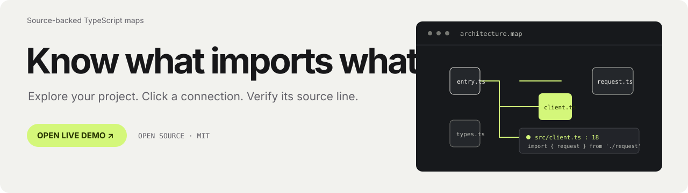
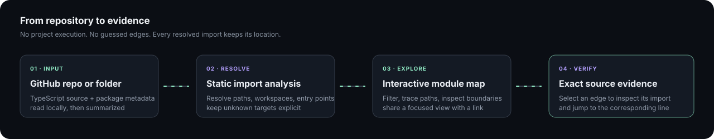
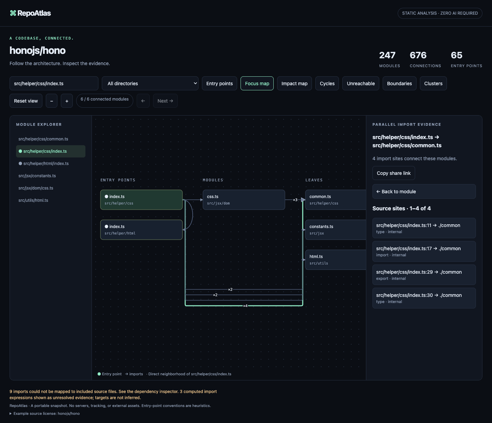
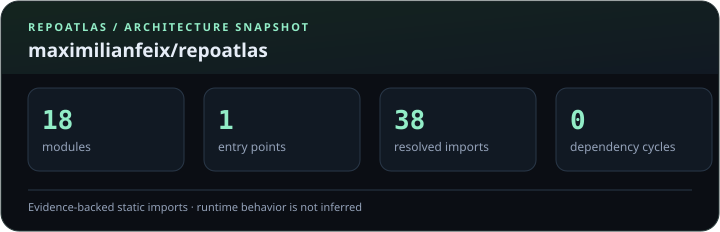
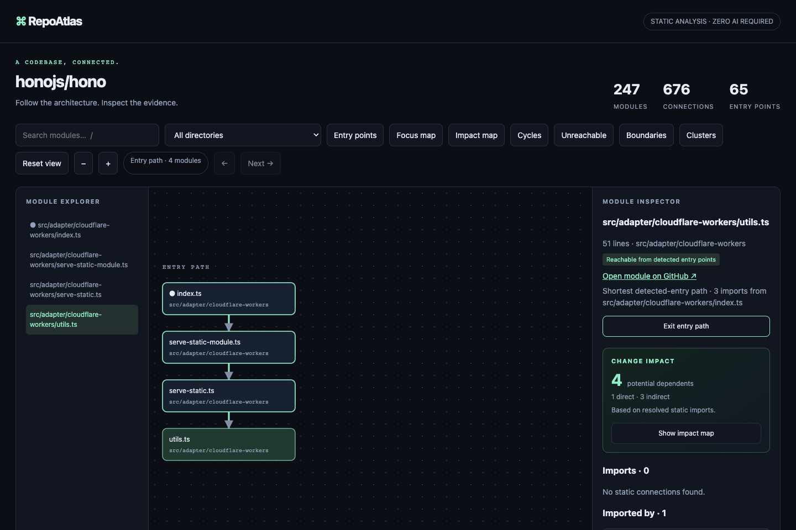
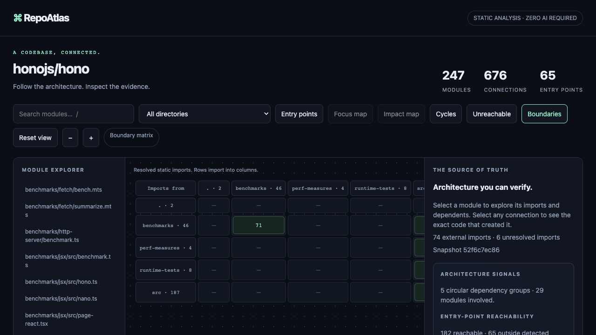
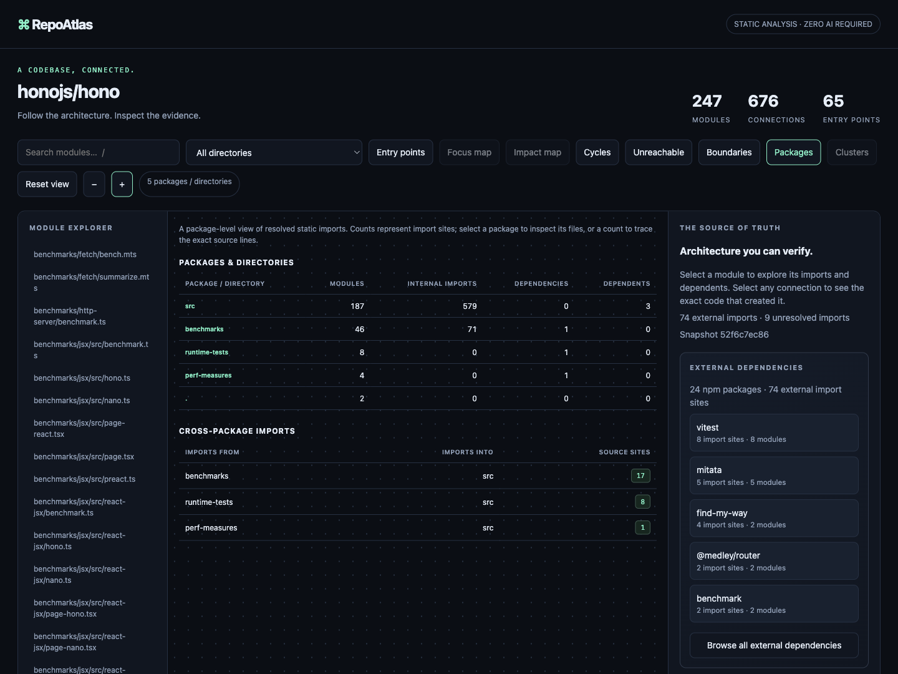
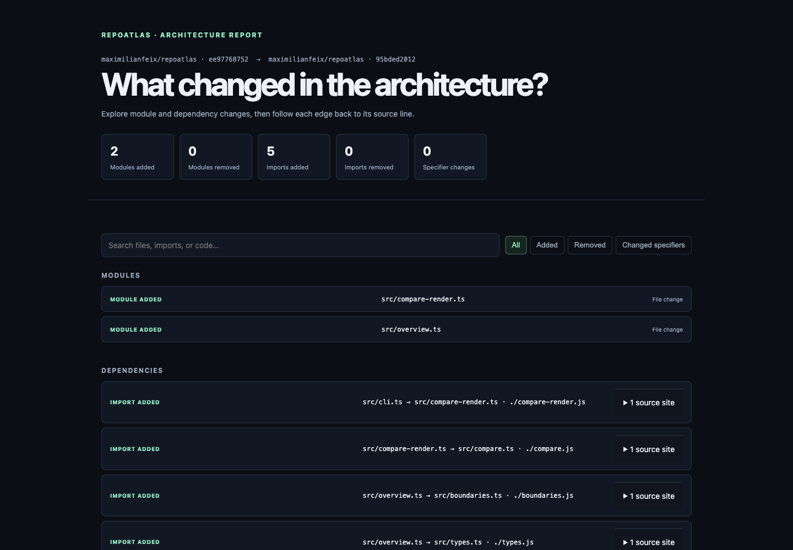

<p align="center">
  <picture>
    <source media="(prefers-color-scheme: dark)" srcset="docs/assets/banner-dark.svg">
    
  </picture>
</p>

<p align="center">
  <a href="https://github.com/maximilianfeix/repoatlas/releases/latest"></a>
  <a href="https://github.com/maximilianfeix/repoatlas/actions/workflows/ci.yml"></a>
  <a href="https://github.com/maximilianfeix/repoatlas/actions/workflows/codeql.yml"></a>
  <a href="https://github.com/maximilianfeix/repoatlas/blob/main/LICENSE"></a>
  <a href="https://skills.sh/maximilianfeix/repoatlas"></a>
</p>

<p align="center">
  <a href="https://maximilianfeix.github.io/repoatlas/examples/hono.html"></a>
  <a href="https://maximilianfeix.github.io/repoatlas/#make-a-map"></a>
  <a href="#github-actions"></a>
</p>

<p align="center"><a href="https://maximilianfeix.github.io/repoatlas/#make-a-map">Browser map</a> &nbsp;·&nbsp; <a href="#quickstart">CLI</a> &nbsp;·&nbsp; <a href="#what-the-map-shows">What you can explore</a> &nbsp;·&nbsp; <a href="#mcp-server">Coding agents</a> &nbsp;·&nbsp; <a href="#scope-and-privacy">Scope &amp; privacy</a></p>

<details>
  <summary><strong>Contents</strong></summary>

- [See the map](#a-real-map-not-a-mockup)
- [Quickstart](#quickstart)
- [GitHub Actions](#github-actions)
- [MCP server](#mcp-server)
- [Agent skill](#install-the-repoatlas-agent-skill)
- [What the map shows](#what-the-map-shows)
- [Features](#features)
- [Compare snapshots](#compare-snapshots)
- [Enforce boundaries in CI](#enforce-boundaries-in-ci)
- [Scope and privacy](#scope-and-privacy)
- [Contribute](#contribute)
</details>

RepoAtlas turns a TypeScript repository into a map you can investigate. Follow an import across modules, click the connection, and inspect the exact source line that created it. Export the result as one offline HTML file and share the architecture with your team.

<p align="center">
  <picture>
    <source media="(prefers-color-scheme: dark)" srcset="docs/assets/readme-flow.svg">
    
  </picture>
</p>

## A real map, not a mockup

<p align="center">
  <a href="https://maximilianfeix.github.io/repoatlas/examples/hono.html"></a>
</p>

<p align="center"><sub>In this Hono snapshot, one bundled edge represents four imports. Select it to inspect each location.</sub></p>

<p align="center">
  
  
  
</p>

<p align="center"><sub>Counts from <a href="https://github.com/honojs/hono/tree/52f6c7ec865b31001a14eed9b323a0235f0a3156">Hono commit 52f6c7e</a>; regenerate with the pinned revision in <a href="docs/examples/manifest.json">the demo manifest</a>.</sub></p>

## Quickstart

Want to explore before installing? [Paste a public TypeScript repository or choose a local project folder](https://maximilianfeix.github.io/repoatlas/#make-a-map). A background worker analyzes the source while the page stays responsive and reports progress; cancel stops that worker immediately. The browser exports one offline HTML file. Local folders work for private or unpushed projects; no account, token, Node.js, or RepoAtlas server is involved. Browser analysis supports up to 1,200 files, 25 MB total, and 1 MB per file; use the CLI for larger projects.

For a versioned command-line run, install nothing globally. The CLI requires **Node.js 22 or later** and **Git**. Point it at a public GitHub repository:

```sh
npx --yes --package=github:maximilianfeix/repoatlas#v2.10.0 -- \
  repoatlas-cli https://github.com/pmndrs/zustand --out zustand-map.html
```

Open `zustand-map.html` in your browser. RepoAtlas also analyzes a local checkout:

```sh
npx --yes --package=github:maximilianfeix/repoatlas#v2.10.0 -- \
  repoatlas-cli ./my-project --out architecture.html
```

It downloads the versioned CLI from GitHub. The `repoatlas-cli` alias ensures `npx` uses the selected release even when another `repoatlas` is installed globally. No global install, API key, or token for a public repository is needed.
Each GitHub release also includes an installable `.tgz` package for direct downloads or private registries.

## Share an architecture card

Create a compact SVG for a README or project page from a RepoAtlas JSON snapshot:

```sh
repoatlas-cli https://github.com/pmndrs/zustand --json > architecture.json
repoatlas-cli report architecture.json --format card --output docs/architecture.svg
```

The card summarizes modules, detected entry points, resolved static imports, and dependency cycles. It is deterministic, contains no scripts or external requests, and states that it does not describe runtime behavior. Use `--overwrite` to replace an existing card. The [refresh workflow](.github/workflows/architecture-card.yml) shows how to regenerate a checked-in card through a reviewable pull request.

<p align="center"></p>

## GitHub Actions

Build the map on every push and keep it as a downloadable workflow artifact:

```yaml
name: Architecture map
on: [push]
permissions:
  contents: read
jobs:
  map:
    runs-on: ubuntu-latest
    steps:
      - uses: actions/checkout@3d3c42e5aac5ba805825da76410c181273ba90b1 # v7.0.1
      - uses: maximilianfeix/repoatlas@v2.10.0
        with:
          output: repoatlas-map.html
```

For pull requests, set `compare-to` to the base commit SHA to make the artifact a source-linked architecture diff. RepoAtlas also adds a short change summary and direct artifact link to the GitHub Actions job summary. This uses only `contents: read`; it does not post a comment or need a write token.

```yaml
name: Architecture review
on: [pull_request]
permissions:
  contents: read
jobs:
  architecture:
    runs-on: ubuntu-latest
    steps:
      - uses: actions/checkout@3d3c42e5aac5ba805825da76410c181273ba90b1 # v7.0.1
      - uses: maximilianfeix/repoatlas@v2.10.0
        with:
          compare-to: ${{ github.event.pull_request.base.sha }}
          output: architecture-diff.html
          artifact-name: architecture-diff
```

Download `architecture-diff` from the workflow run to explore added and removed modules and imports; each edge links to the exact base or head source line. The action accepts `path`, `compare-to`, `artifact-name`, `retention-days`, `include-tests`, and `include-js`. It needs read-only repository access and no token input. Maps and diffs include project paths and source snippets, so restrict artifacts from private repositories.

## MCP server

Give a coding agent a local architecture map it can query while it works. RepoAtlas exposes deterministic tools over MCP stdio; the server does not send source to a hosted service, write to the repository, or make network requests after launch. Your MCP client sends returned context to the model provider configured for that client.

Add this server entry to an MCP client configuration and replace the project path with an absolute path:

```json
{
  "mcpServers": {
    "repoatlas": {
      "command": "npx",
      "args": [
        "--yes",
        "--package=github:maximilianfeix/repoatlas#v2.10.0",
        "repoatlas-cli",
        "mcp",
        "/absolute/path/to/project"
      ]
    }
  }
}
```

The tools summarize the architecture, search modules, inspect direct import evidence, trace a module from a detected entry, and refresh the analysis after edits. Every reported edge includes its exact source line; no runtime call graph or inferred import target is claimed. The server requires Node.js 22 or later and analyzes TypeScript by default. Use `--include-js` or `--include-tests` after `mcp` to opt in to those files.

### Install the RepoAtlas agent skill

Give a coding agent RepoAtlas's evidence-first workflow with one command:

```sh
npx skills add maximilianfeix/repoatlas --skill repoatlas --agent codex --yes
```

The skill uses a configured RepoAtlas MCP server when available and otherwise guides the agent to the local CLI or browser map. It keeps source evidence grounded in TypeScript files, distinguishes imports from runtime behavior, and does not install packages or write into a project on its own. Replace `codex` with another supported agent name to target that agent.

## What the map shows

Each example below was generated from a pinned upstream commit. The counts and evidence can be reproduced from the source revision.

| Project snapshot | Modules | Connections | Useful views |
| --- | ---: | ---: | --- |
| [RepoAtlas 1.10 → 2.0](https://github.com/maximilianfeix/repoatlas/compare/ee977687527b806925ff2a31f2311dce65d320ad...95bded201295c1c4b4e2330263fc26060c641073) | 15 → 17 | 29 → 34 | [Open the real HTML diff](https://maximilianfeix.github.io/repoatlas/examples/repoatlas-v1-to-v2.html) · added modules and imports |
| [honojs/hono](https://github.com/honojs/hono/tree/52f6c7ec865b31001a14eed9b323a0235f0a3156) | 247 | 676 | [Open map](https://maximilianfeix.github.io/repoatlas/examples/hono.html) · entry paths, cycles, bundled imports |
| [sindresorhus/ky](https://github.com/sindresorhus/ky/tree/0d59458a0a58e1c3d7c6db0ab17ed5c7cd671e47) | 51 | 93 | [Open map](https://maximilianfeix.github.io/repoatlas/examples/ky.html) · external packages, import sites |
| [pmndrs/zustand](https://github.com/pmndrs/zustand/tree/b57db4f86ef179285da216eeb291266da82c361c) | 18 | 24 | [Open map](https://maximilianfeix.github.io/repoatlas/examples/zustand.html) · workspace boundaries |

<table>
  <tr>
    <td width="50%" valign="top"><a href="https://maximilianfeix.github.io/repoatlas/examples/hono.html"></a><sub>Follow the shortest path from an entry point.</sub></td>
    <td width="50%" valign="top"><a href="https://maximilianfeix.github.io/repoatlas/examples/hono.html"></a><sub>See which package and directory boundaries imports cross.</sub></td>
  </tr>
  <tr>
    <td colspan="2" valign="top"><a href="https://maximilianfeix.github.io/repoatlas/examples/hono.html"></a><sub>Start broad, then drill into a package or open a count to inspect its exact source imports.</sub></td>
  </tr>
  <tr>
    <td colspan="2" valign="top"><a href="https://maximilianfeix.github.io/repoatlas/examples/repoatlas-v1-to-v2.html"></a><sub>A real RepoAtlas 1.10 → 2.0 comparison. Expand an import to trace its source line in the pinned snapshot.</sub></td>
  </tr>
</table>

The analyzed revisions and upstream license notices are recorded in [`docs/examples/manifest.json`](docs/examples/manifest.json) and [`THIRD_PARTY_NOTICES.md`](THIRD_PARTY_NOTICES.md).

The RepoAtlas comparison uses real snapshots from [v1.10.0](https://github.com/maximilianfeix/repoatlas/tree/ee977687527b806925ff2a31f2311dce65d320ad) and [the v2 feature commit](https://github.com/maximilianfeix/repoatlas/tree/95bded201295c1c4b4e2330263fc26060c641073). Its source links are pinned to those commits.

## Features

<table>
  <tr>
    <td width="50%" valign="top"><strong>Trace every connection</strong><br>Open the import statement and exact line behind an edge. Bundled imports keep every individual location; clean checkouts link to the pinned source on GitHub.</td>
    <td width="50%" valign="top"><strong>Start in the browser</strong><br>Paste a public GitHub URL or choose a private local folder. A cancellable background worker keeps the page responsive and shows progress. Inspect the interactive map and download a standalone HTML file; project source stays on your device.</td>
    <td width="50%" valign="top"><strong>Get oriented quickly</strong><br>See detected entries, reachability, cycles, impact, external packages, and shortest entry paths. Share a focused view with a deep link.</td>
  </tr>
  <tr>
    <td width="50%" valign="top"><strong>Read workspace boundaries</strong><br>Start with a ranked package and directory overview, then drill into a package or open any import count to inspect its exact source lines. Resolve declared npm, Yarn, and pnpm workspace packages through export maps in CLI and browser analysis.</td>
    <td width="50%" valign="top"><strong>See active hotspots</strong><br>Optionally color modules by bounded local Git history, with committed touch counts and the last changed date. No author identities, risk grades, or implicit history scan.</td>
  </tr>
  <tr>
    <td width="50%" valign="top"><strong>Catch architecture drift</strong><br>Compare JSON snapshots to find changed modules, dependencies, and import specifiers. Export the comparison as a searchable standalone HTML report with source links. Formatting and line shifts alone do not count as drift.</td>
    <td width="50%" valign="top"><strong>Set rules for CI</strong><br>Fail builds on forbidden boundaries, dependency cycles, or unreachable-module limits. Reports include the source file and line.</td>
    <td width="50%" valign="top"><strong>Share a portable map</strong><br>Export one offline HTML file, the full JSON snapshot, a boundary SVG, or a concise CI report. The viewer makes no network requests.</td>
  </tr>
</table>

### See where development is active

An optional local Git history lens colors modules by committed file touches, shows the last changed date, and keeps the period visible in the map. It records no author names and does not turn activity into a risk or quality score. GitHub URL analysis fetches at most 2,000 recent commits and counts only changes inside the selected window; shallow or capped history is labeled when that limit could omit data. This is available for Git repositories and is off by default.

```sh
repoatlas https://github.com/owner/repo --activity-days 90 --out activity-map.html
repoatlas ./my-project --activity-days 30 --out activity-map.html
```

Select **Activity** in the map toolbar, then choose a module to see its committed-change count and last changed date. The lens reflects committed history; uncommitted file content is still analyzed as usual.

### Compare snapshots

```sh
repoatlas ./my-project --json > before.json
# Update the checkout, then save the next snapshot.
repoatlas ./my-project --json > after.json
repoatlas compare before.json after.json
repoatlas compare before.json after.json --format html --output architecture-diff.html
```

Open `architecture-diff.html` to filter added, removed, and changed relationships, search paths or imports, and expand each dependency to its source line in both snapshots. The report is a single offline file. It links to commit-pinned source on GitHub when the snapshots contain source URLs.

In the map, choose **Packages** for a ranked overview of workspace packages and top-level source directories. The dependency rows count resolved internal import sites; selecting a package opens its modules, and selecting a count lists every contributing source line. Use **Boundaries** for the full source-by-target matrix.

### Enforce boundaries in CI

Save rules in `repoatlas.config.json`:

```json
{
  "forbiddenImports": [
    { "from": "package:apps/web", "to": "package:packages/database" }
  ],
  "limits": {
    "cycleGroups": 0,
    "unreachableModules": 12
  }
}
```

Then generate and check a snapshot:

```sh
repoatlas ./my-project --json > atlas.json
repoatlas check atlas.json --config repoatlas.config.json --format github
```

Boundary IDs use `package:<workspace path>` for declared workspace packages and `directory:<top-level source folder>` otherwise. If no entry point is detected, reachability remains unknown and does not fail the unreachable-module limit. Run `repoatlas check --help` for output formats; snapshot compatibility is documented in [`SCHEMA.md`](SCHEMA.md).

## Scope and privacy

RepoAtlas describes **static file dependencies**. It does not claim to show runtime calls, route registrations, or test coverage. It detects entries from package metadata and file conventions; “unreachable” means no path was found from detected entries, not that a file is dead. If entries are unknown, reachability remains unknown. Computed imports stay visible as unresolved evidence rather than receiving guessed targets.

The CLI is limited to 5,000 source files and 2 MB per file. Tests, generated directories, declarations, and hidden files are excluded by default; use `--include-tests` or `--include-js` to opt in. Local edits disable commit-pinned GitHub links. Exported maps make no network requests and do not copy repository credentials.

The browser can analyze a public URL or a private local folder. Analysis runs in a dedicated worker, and canceling terminates that worker. Selected local source never leaves the browser; choose a folder explicitly, and review the exported snippets before sharing. Browser mode loads the version-pinned TypeScript compiler from jsDelivr, but sends it no project data.

Browser analysis is capped at 1,200 TypeScript files, 25 MB total, and 1 MB per file. For a public URL it fetches the tree and source from GitHub; for a private or unpushed project choose a local folder. In both cases, source files are analyzed in the browser and never sent to a RepoAtlas server. The version-pinned TypeScript compiler loads from jsDelivr; it receives no project data. GitHub allows 60 unauthenticated API requests per hour per IP. Maps contain source snippets, so share them only with people authorized to read that source.

## Contribute

```sh
git clone https://github.com/maximilianfeix/repoatlas.git
cd repoatlas
npm ci
npm test
npm run check
npm run check:ts7
```

See [`CONTRIBUTING.md`](CONTRIBUTING.md) for development notes. Report bugs or suggest improvements in [GitHub Issues](https://github.com/maximilianfeix/repoatlas/issues). RepoAtlas is MIT licensed.
