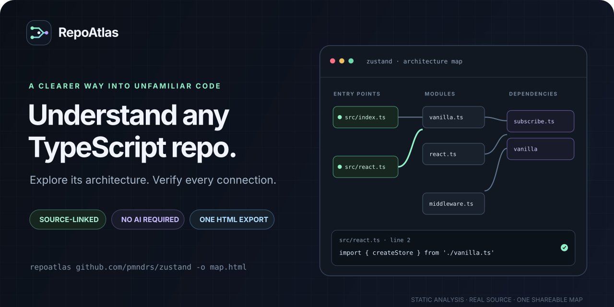

<p align="center">
  
</p>

<h3 align="center">Understand any TypeScript repo in one interactive map.</h3>
<p align="center">Every connection is backed by a real source line you can inspect.</p>

<p align="center">
  <a href="https://github.com/maximilianfeix/repoatlas/stargazers"></a>
  <a href="https://github.com/maximilianfeix/repoatlas/actions/workflows/ci.yml"></a>
  <a href="https://github.com/maximilianfeix/repoatlas/blob/main/LICENSE"></a>
  
</p>

<p align="center">
  <a href="https://maximilianfeix.github.io/repoatlas/"><strong>Live demo</strong></a> ·
  <a href="#try-the-map-in-20-seconds">Try the map</a> ·
  <a href="#get-started">Get started</a> ·
  <a href="CONTRIBUTING.md">Contribute</a>
</p>

<p align="center"></p>

## Explore a real codebase in 20 seconds

1. Open the [Zustand architecture map](https://maximilianfeix.github.io/repoatlas/examples/zustand.html).
2. Select `src/index.ts` and see what it connects to.
3. Click a connection to inspect the import and exact line number.
4. Open the pinned GitHub source permalink. That is the evidence behind the edge.

No setup, sign-in, API key, or AI service needed. The map is already built and ready to explore.

## Try the map in 20 seconds

| Project | Get a feel for it | Snapshot |
| --- | --- | --- |
| **[Zustand](https://maximilianfeix.github.io/repoatlas/examples/zustand.html)** | A small state library; follow its entry points into the store | 18 modules · 23 connections |
| **[Ky](https://maximilianfeix.github.io/repoatlas/examples/ky.html)** | An HTTP client with a focused, layered source tree | 51 modules · 93 connections |
| **[Hono](https://maximilianfeix.github.io/repoatlas/examples/hono.html)** | A larger framework; search and filter to find your way | 247 modules · 676 connections |

These are real TypeScript repositories analyzed at pinned commits. Downloadable HTML and commit details are in [`docs/examples`](docs/examples) and [`manifest.json`](docs/examples/manifest.json).

## What you can see

- **Where to start:** package entry fields and clearly labeled filename-based entry-point hints.
- **How files connect:** static imports, re-exports, type imports, literal dynamic imports, and literal `require` calls.
- **Why an edge exists:** select a connection to see the source statement, line number, and pinned GitHub permalink.
- **What did not resolve:** external and unresolved dependencies stay visible in the inspector; RepoAtlas does not invent connections.
- **A map you can explore:** search, directory filters, entry-point filtering, zoom, keyboard navigation, and a module inspector.
- **A file you can share:** export a standalone HTML map with embedded graph data and viewer. The map itself works offline.
- **A JSON interface:** send the same analysis to scripts and other tools with `--json`.

## Get started

Requires **Node.js 22+**. Git is needed to analyze a remote repository; local analysis works offline. RepoAtlas is not published to npm yet.

```sh
git clone https://github.com/maximilianfeix/repoatlas.git
cd repoatlas
npm ci
npm run build
npm link

repoatlas https://github.com/pmndrs/zustand -o zustand.html
```

Open `zustand.html` in any browser. To map a local project instead:

```sh
repoatlas ./my-project -o architecture.html
repoatlas https://github.com/honojs/hono --ref main -o hono.html
repoatlas . --include-tests --json > graph.json
repoatlas --json doctor
repoatlas --help
```

Existing output files are protected; use `--force` to replace one. Private repositories use your existing Git credential helper. Credentials are never embedded in an export. **Maps include repository paths and source snippets**, so share maps of private projects only with the right people.

## How it works

```text
GitHub URL or local directory
          ↓
TypeScript source + nearest tsconfig + package entry fields
          ↓
TypeScript compiler AST + module resolution
          ↓
Evidence-backed dependency graph → one interactive HTML file
```

The analyzer uses the TypeScript 6.0 compiler API, pinned deliberately. TypeScript 7 removes the standalone `resolveModuleName` API RepoAtlas uses. The full regression suite is verified against 6.0.3, including Node and bundler resolution modes. Follow [TypeScript 7 compatibility](https://github.com/maximilianfeix/repoatlas/issues/5) for updates. See the [TypeScript 6 release notes](https://www.typescriptlang.org/docs/handbook/release-notes/typescript-6-0.html) and [module-resolution reference](https://www.typescriptlang.org/tsconfig/moduleResolution).

## Scope and limits

RepoAtlas maps **static file dependencies**, not runtime calls or an AI-generated architecture narrative. It does not install dependencies or run a target repository's code. Framework routing, dependency injection, and computed imports cannot be inferred reliably. Missing dependencies and shared TypeScript configs can leave imports unresolved; diagnostics are included in the map.

Generated directories, declaration files, hidden files, and tests are excluded by default. `--include-tests` includes tests and fixtures. Analysis is limited to 5,000 files and 2 MB per source file. The graph renders the first 100 matching modules at a time; search and directory filters help explore larger projects. All analyzed connections remain in the export and JSON.

Symlinked paths are skipped and resolver reads stay inside the selected directory. Local modifications disable GitHub links so the evidence cannot silently point at different source. Exports make no network requests; viewer scripts and styles are protected by a strict hash-based Content Security Policy.

## Contributing

Small repositories that reproduce a module-resolution edge case are especially useful. Start with [`CONTRIBUTING.md`](CONTRIBUTING.md); current plans and known gaps are tracked in [GitHub Issues](https://github.com/maximilianfeix/repoatlas/issues).

```sh
npm ci
npm test
npm run check
```

MIT licensed. Example source snippets retain their upstream licenses, listed in [`THIRD_PARTY_NOTICES.md`](THIRD_PARTY_NOTICES.md).

---

<p align="center">If RepoAtlas helps you get oriented in an unfamiliar codebase, <a href="https://github.com/maximilianfeix/repoatlas">give it a star on GitHub</a> — it helps other developers find the project.</p>
