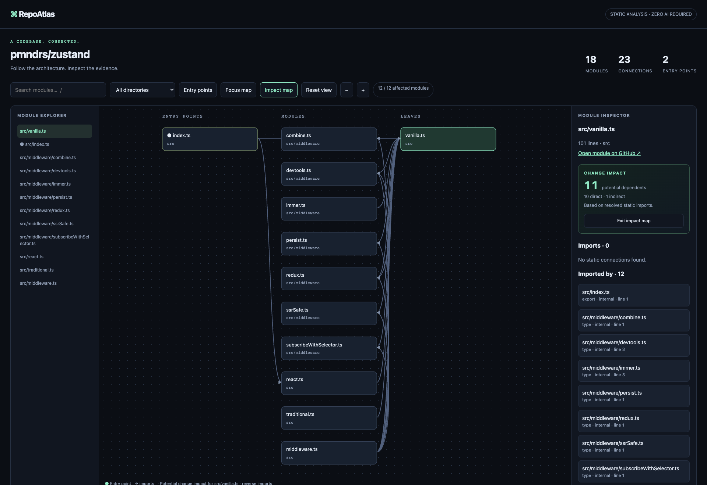

<h1 align="center">
  
</h1>

<h2 align="center">Map a TypeScript codebase.<br>Trace every connection to source.</h2>

<p align="center">Understand an unfamiliar project through its entry points, modules, and imports. Select any connection to inspect the original code and line.</p>

<p align="center">
  <a href="https://github.com/maximilianfeix/repoatlas/stargazers"></a>
  <a href="https://github.com/maximilianfeix/repoatlas/actions/workflows/ci.yml"></a>
  <a href="https://github.com/maximilianfeix/repoatlas/actions/workflows/codeql.yml"></a>
  <a href="https://github.com/maximilianfeix/repoatlas/blob/main/LICENSE"></a>
  
</p>

<p align="center">
  <a href="https://maximilianfeix.github.io/repoatlas/examples/zustand.html"><strong>Open the interactive demo</strong></a> ·
  <a href="https://maximilianfeix.github.io/repoatlas/#make-a-map">Build a command</a> ·
  <a href="#quickstart">Quickstart</a> ·
  <a href="#github-actions">GitHub Action</a> ·
  <a href="https://github.com/maximilianfeix/repoatlas/issues">Issues</a>
</p>

<p align="center">
  <a href="https://maximilianfeix.github.io/repoatlas/examples/hono.html"></a>
</p>

RepoAtlas creates a **standalone, interactive architecture map** from a TypeScript project. Unlike a diagram inferred from prose, each internal connection comes from a parsed import and can be checked against its exact source line. The exported HTML works offline and can be shared as one file.

## Quickstart

Requires **Node.js 22+** and **Git**. Map a public GitHub repository:

```sh
npx --yes --package=github:maximilianfeix/repoatlas -- repoatlas https://github.com/pmndrs/zustand -o zustand-map.html
```

Open `zustand-map.html` in your browser. No clone, account, API key, or global install is needed. For a local checkout, replace the repository URL with its directory:

RepoAtlas currently installs from GitHub; it is not published to the npm registry.

```sh
npx --yes --package=github:maximilianfeix/repoatlas -- repoatlas ./my-project -o architecture.html
```

## GitHub Actions

Generate a map for every push and download it from the workflow run's **Artifacts** section. Add `.github/workflows/architecture.yml`:

```yaml
name: Architecture map
on: [push]
permissions:
  contents: read
jobs:
  map:
    runs-on: ubuntu-latest
    steps:
      - uses: actions/checkout@3d3c42e5aac5ba805825da76410c181273ba90b1 # v7.0.1
      - uses: maximilianfeix/repoatlas@v0.2.0
        with:
          output: repoatlas-map.html
```

The action also accepts `path`, `artifact-name`, `retention-days`, and `include-tests`. It needs no token or write permission. Maps embed project paths and source snippets; treat artifacts for private repositories as source code and limit access accordingly.

## Explore real projects

These maps are pinned to the analyzed source commit and need no install:

| Repository | Modules | Connections | Explore |
| --- | ---: | ---: | --- |
| [Zustand](https://github.com/pmndrs/zustand) | 18 | 23 | [Open map](https://maximilianfeix.github.io/repoatlas/examples/zustand.html) |
| [Ky](https://github.com/sindresorhus/ky) | 51 | 93 | [Open map](https://maximilianfeix.github.io/repoatlas/examples/ky.html) |
| [Hono](https://github.com/honojs/hono) | 247 | 676 | [Open map](https://maximilianfeix.github.io/repoatlas/examples/hono.html) |

The analyzed commits, warnings, and upstream license notices are listed in [`docs/examples/manifest.json`](docs/examples/manifest.json) and [`THIRD_PARTY_NOTICES.md`](THIRD_PARTY_NOTICES.md).

## What you can inspect

- **Project shape:** source modules, directories, and likely entry points.
- **Dependencies:** static imports, re-exports, type imports, literal dynamic imports, and literal `require` calls.
- **Evidence:** the exact import statement and line, with a commit-pinned GitHub link when the checkout is clean.
- **Explore and assess change:** search, directory and entry-point filters, Focus map for direct neighbors, and Impact map for every transitively dependent module.
- **Spot architecture risks:** isolate circular import groups, trace the exact cycle edges, and jump straight to the most depended-on modules.
- **Portable output:** one offline HTML file, or the full graph as JSON for other tools.

```sh
repoatlas https://github.com/honojs/hono --ref main -o hono-map.html
repoatlas . --include-tests -o project-map.html
repoatlas . --json > graph.json
repoatlas --help
```

## Scope and privacy

RepoAtlas performs **static file-dependency analysis**. Impact map follows resolved internal imports backwards to show potential dependents; circular dependency groups use strongly connected components over the same resolved graph. These are source-level signals, not runtime or test-coverage guarantees. RepoAtlas does not execute project code, install target dependencies, or infer runtime calls, framework routes, or computed imports. Unresolved and external dependencies remain visible as unresolved or external.

Generated directories, declaration files, hidden files, and tests are excluded by default. Use `--include-tests` to include tests and fixtures. Analysis is limited to 5,000 files and 2 MB per source file; the interactive map displays up to 100 matching modules at a time, while JSON retains the full analyzed graph. Local edits disable GitHub source links, but source evidence remains embedded in the HTML.

Repository credentials are not copied into the map. Files are read from the selected directory; symlinks are skipped, reads stay within that directory, and the viewer makes no network requests. Since the map contains source snippets, share private-repository maps only with people who already have access to that code.

<details>
<summary>Implementation and compatibility notes</summary>

RepoAtlas requires Node.js 22 or newer and uses the TypeScript 6.0.3 compiler API. TypeScript 7 compatibility is tracked in [issue #5](https://github.com/maximilianfeix/repoatlas/issues/5). The generated viewer uses a hash-based Content Security Policy for its inline scripts and styles. Known limits and requests are tracked in [GitHub Issues](https://github.com/maximilianfeix/repoatlas/issues).

</details>

## Contribute

```sh
git clone https://github.com/maximilianfeix/repoatlas.git
cd repoatlas
npm ci
npm test
npm run check
```

Bug reports and focused improvements are welcome. Start with [`CONTRIBUTING.md`](CONTRIBUTING.md). RepoAtlas is [MIT licensed](LICENSE).

---

<p align="center">If RepoAtlas helped you understand a codebase, <a href="https://github.com/maximilianfeix/repoatlas">give it a star</a> so more developers can find it.</p>
